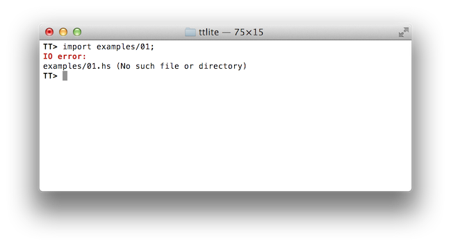
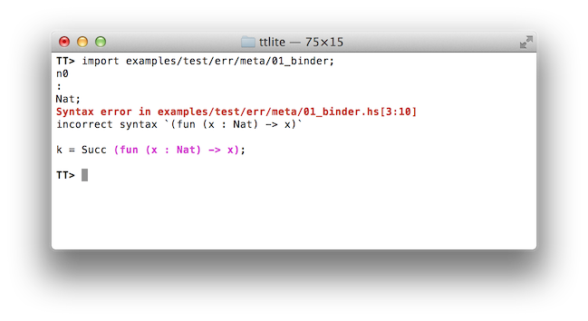
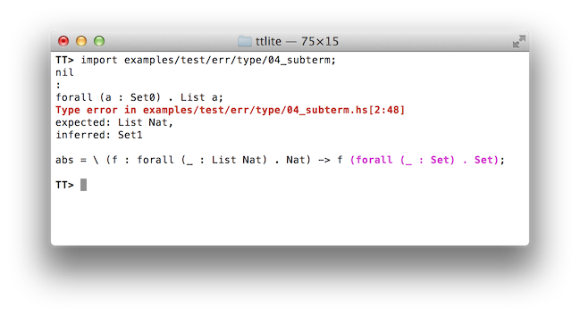

## Error handling in TT Lite

There are four kind or errors in TT Lite REPL.

#### IO Error – when a file cannot be read.

   

#### Lexical error – when an input cannot be correctly parsed by shallow parser.

   

#### Parse error – when a shallow syntax cannot be translated into an abstract syntax.

   

#### Type error - when a (sub)-expression is not well-typed.

   
   
In the two last cases TT Lite REPL highlights an erroneous expression.

### How an erroneous expression is highlighted.

In order to mark an erroneous expression we need to keep positional information where it is
located in the source code. Shallow terms have such information and there is no problem to
correctly report a text region for parse errors (since we already analyze a shallow expression).
However, type-checking procedure deals with AST – not shallow terms. It is possible to store
a positional information in a TT Lite term, but it will be a bad decision for following reasons.

* Not every AST has a direct mapping onto source location. During type-checking terms are
normalized and to have an optional positional information for normalized term is misleading.
* It will result into unnecessary complication of classes and operations for AST.

Note that the only scenario when we need to have positional information for AST fragments is
type-checking. Also note that an original shallow term and a corresponding TT Lite term are isomorphic.
Each part of TT Lite term corresponds to some part of original shallow term.

So we have a following simple solution for marking not well-typed terms.

1. Type checking is a top-down traversal of an AST. We keep a path from the top TT Lite term
to the current term being type checked.
2. When there is a typing error – we throw a typing error exception which has information
about path to the incorrect term.
3. In the top REPL loop we have a corresponding shallow term in hand. We catch a typing error,
extract a path from it and locate a corresponding subterm in the shallow term.
4. Since all parts of a shallow term have positional information, marking becomes trivial.
